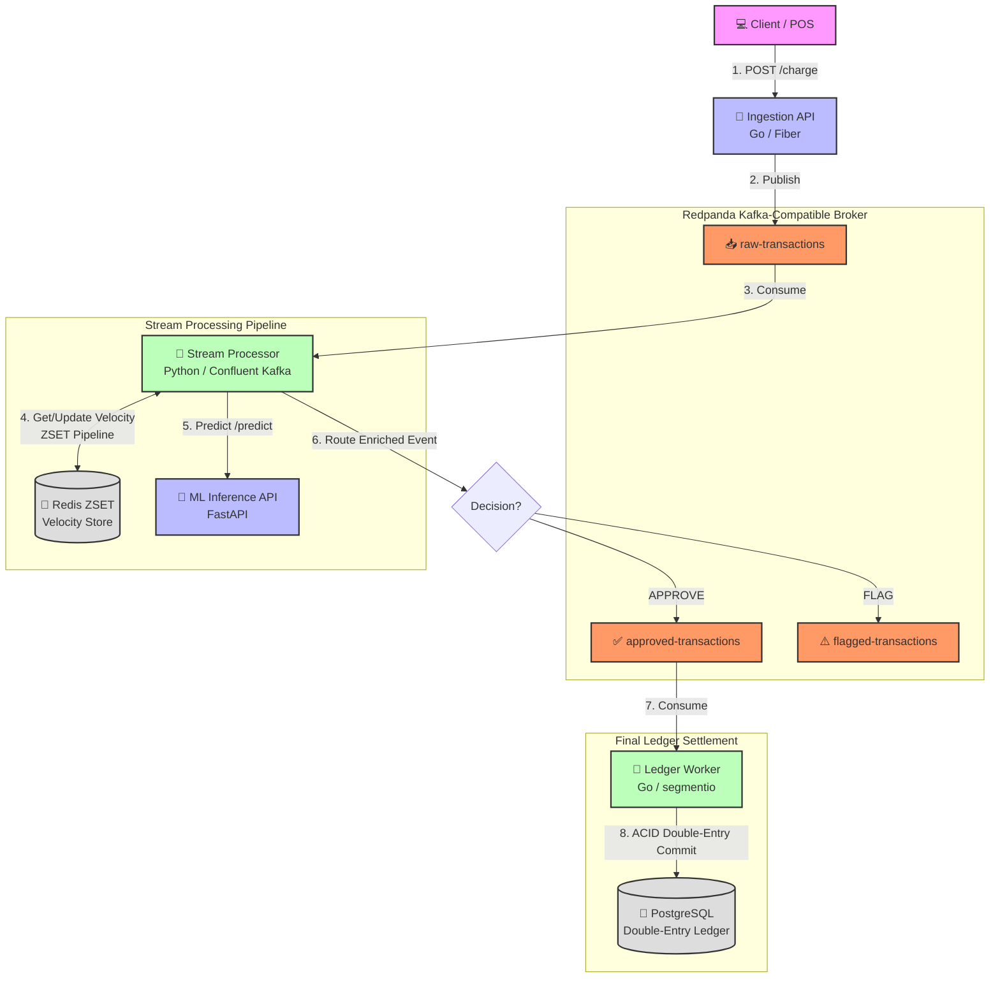

# 🛡️ AegisStream: Real-Time Fraud Detection & Distributed Ledger Engine

[](https://golang.org)
[](https://python.org)
[](https://fastapi.tiangolo.com)
[](https://redpanda.com)
[](https://redis.io)
[](https://postgresql.org)
[](https://docker.com)

**AegisStream** is a high-performance, production-grade, event-driven streaming platform engineered to process financial transactions, detect fraud in real-time under a **50ms latency budget**, and record immutable double-entry ledger journals. 

It synthesizes modern distributed systems designs—including event-driven stream processing, sliding-window feature caching, microsecond-latency ML serving, and ACID-compliant transactional databases—into a seamless and resilient financial operations engine.

---

## 📐 System Architecture

The following diagram illustrates the lifecycle of a transaction through **AegisStream**, tracing how data flows through ingestion, state enrichment, ML inference, classification, and final ledger auditing.



---

## ⚡ Core Components

The engine is divided into four highly focused services, each running within a dedicated layer:

### 1. 🚀 Ingestion API (`ingestion-api`)
* **Technology Stack**: Go, Fiber Web Framework, `confluent-kafka-go`
* **Role**: The high-throughput gateway. It exposes a low-overhead REST endpoint to receive incoming payment charges.
* **Responsibilities**:
  * Receives transaction payloads (`POST /charge`).
  * Validates JSON payload structures.
  * Publishes events to the Redpanda `raw-transactions` topic with high durability guarantees.
  * Delivers sub-millisecond response times under heavy concurrent stress.

### 2. 🔄 Stream Processor (`stream-processor`)
* **Technology Stack**: Python, `confluent-kafka`, `redis-py`, `httpx`
* **Role**: The central nervous system of the streaming pipeline.
* **Responsibilities**:
  * Consumes raw transaction streams from `raw-transactions`.
  * **Atomically enriches** transaction events with sliding-window aggregates from the Redis feature store.
  * Queries the ML Serving engine via a persistent HTTP connection pool (`httpx.Client`) to avoid TCP socket handshakes.
  * **Defensive Fallback Rules**: Implements fail-safe heuristics (e.g., auto-flagging transactions > $500.0) if the ML Serving API experiences downtime or high-latency timeouts.
  * Routes the enriched payload to either `approved-transactions` or `flagged-transactions` based on the classification.

### 3. 🧠 ML Serving Engine (`ml-serving`)
* **Technology Stack**: Python, FastAPI, Pydantic, Uvicorn
* **Role**: Microsecond-latency machine learning inference service.
* **Responsibilities**:
  * Exposes `/predict` endpoint to evaluate structured transaction vector features:
    * `count_5m`: Number of transaction occurrences in the last 5 minutes.
    * `velocity_5m`: Total spending sum in the last 5 minutes.
    * `amount`, `device_id`, and `user_id`.
  * Executes scoring logic under a **10ms target SLA**.
  * Classifies transactions exceeding a `0.85` threshold as `FLAG`, otherwise `APPROVE`.

### 4. 💼 Ledger Worker (`ledger-worker`)
* **Technology Stack**: Go, `database/sql`, `segmentio/kafka-go`, PostgreSQL
* **Role**: Transactional settlement and immutable auditing.
* **Responsibilities**:
  * Consumes events from the `approved-transactions` topic.
  * Executes a **strict double-entry bookkeeping** algorithm wrapped inside an ACID transaction.
  * **Idempotency Safeguards**: Utilizes a PostgreSQL `idempotency_keys` uniqueness constraint to prevent double-charging or duplicate message processing.
  * **Deadlock Mitigation**: Leverages deterministic lexicographical order locking of accounts (`FOR UPDATE` SQL queries) before mutating balances, preventing database deadlock scenarios under parallel execution.
  * **Manual Offset Committing**: Kafka partition offsets are manually committed only **after** the SQL database transaction has been successfully committed to disk.

---

## 🏛️ Ledger Database Schema

The system uses an **immutable, double-entry financial ledger** modeled in PostgreSQL. Floating-point rounding issues are completely eliminated using strict `NUMERIC(20, 4)` types.

```
                  ┌────────────────────────┐
                  │        ACCOUNTS        │
                  │   Stores user/merchant │
                  │     current balances   │
                  └───────────┬────────────┘
                              │ 1
                              │
                              │ 1..* (Foreign Key)
                  ┌───────────▼────────────┐
                  │      TRANSACTIONS      │
                  │   Stores raw charge    │
                  │   events & status      │
                  └───────────┬────────────┘
                              │ 1
                              │
                              │ 2 (Double-entry match)
                  ┌───────────▼────────────┐
                  │     LEDGER ENTRIES     │
                  │ Immutable Debit/Credit │
                  │     audit records      │
                  └────────────────────────┘
```

For every successfully approved transaction of **$N**, the Ledger Worker atomically inserts **two matching ledger entries**:
* **DEBIT** (Money Leaving): Deducted from Payer Account (`balance_after = balance_before - N`).
* **CREDIT** (Money Entering): Added to Payer Merchant/Treasury (`balance_after = balance_before + N`).

### 👥 Pre-seeded Sandbox Accounts
The database initializer automatically seeds the PostgreSQL instance with:
* `merchant_treasury`: System treasury receiving all processed funds ($1,000,000.00 USD).
* `user_alice`: $5,000.00 USD
* `user_bob`: $150.00 USD
* `user_charlie`: $20,000.00 USD
* `user_david`: $0.00 USD (Insufficient balance test case).

---

## 🏎️ Production Performance Engineering

* **Ultra-Low Latency Feature Aggregation**: Redis uses a pipeline context running `ZADD`, `ZREMRANGEBYSCORE`, `ZRANGE`, and `EXPIRE` in a **single Network Round Trip (RTT = 1)** using Redis Sorted Sets (ZSET). Sliding windows prune dynamically (removing elements >5 mins old) with a rolling TTL to avoid memory leaks.
* **Lexicographical Deadlock Avoidance**: Database accounts are queried for locks (`FOR UPDATE`) based on `min(PayerID, MerchantID)` and `max(PayerID, MerchantID)`. This guarantees that concurrent thread executions locking the same accounts never cycle, eliminating database deadlocks.
* **Connection Pooling Optimization**: The python stream processor utilizes a shared `httpx.Limits(max_keepalive_connections=10, max_connections=50)` context pool. Keeping TCP socket handshakes alive avoids substantial connection startup costs on each streaming transaction.
* **Kafka Manual Offset Guarantees**: By setting consumer offsets to manually commit, AegisStream ensures **exactly-once processing** guarantees across network boundaries, avoiding missing entries or duplicate updates in database errors.

---

## 🛠️ Local Development & Quick Start

The control panel relies on a robust `Makefile` executing inside **PowerShell**.

### 📋 Prerequisites
* Docker & Docker Compose
* Go 1.21+
* Python 3.10+
* PowerShell (configured as default terminal shell in `Makefile`)

### 🕹️ Control Panel Cheatsheet

| Command | Action | Description |
| :--- | :--- | :--- |
| `make infra-up` | 🚀 **Infrastructure Up** | Boot Postgres, Redis, Redpanda, and Redpanda Console |
| `make create-topics` | 📂 **Setup Topics** | Pre-create `raw-transactions`, `approved-transactions`, `flagged-transactions` |
| `make build-all` | 🛠️ **Build Go Services** | Compile Go binary executables for Ingestion and Ledger |
| `make run-ingestion` | 🔌 **Run Ingestion API** | Start the Fiber Ingestion HTTP web server locally (Port: `8081`) |
| `make run-ml` | 🧠 **Run ML Serving** | Start the FastAPI ML Inference server locally (Port: `8000`) |
| `make run-processor` | 🔄 **Run Stream Processor** | Run the Python streaming consumer-producer loops |
| `make run-ledger` | 💼 **Run Ledger Worker** | Run the Go database ledger transactional writer |
| `make seed-db` | 🌱 **Reset & Seed DB** | Wipes existing tables and re-seeds sandbox test accounts |
| `make test-charge` | 🧪 **Test Charge Request** | Dispatches a mock transaction from `user_alice` for `$450.50` |
| `make db-shell` | 🐘 **Postgres Shell** | Enter an interactive Postgres `psql` console |
| `make redis-shell` | 🔴 **Redis Shell** | Enter an interactive Redis console |
| `make rpk-status` | 🐼 **Redpanda Status** | Display active Redpanda brokers and cluster metrics |
| `make infra-down` | 🧹 **Tear Down** | Stop and purge all local docker containers and volume caches |

---

## 🚀 Step-by-Step Run Book

Follow this checklist to boot and verify the system in your local sandbox:

### Step 1: Initialize Infrastructure
Spin up the backing databases and event queues:
```powershell
make infra-up
```
Once healthy, create the Kafka topics in Redpanda:
```powershell
make create-topics
```

### Step 2: Spin Up Services (Separate Terminals)
Open four terminal sessions or execute in background:

1. **ML serving endpoint**:
   ```powershell
   make run-ml
   ```
2. **Stream processor loop**:
   ```powershell
   make run-processor
   ```
3. **Ledger worker consumer**:
   ```powershell
   make run-ledger
   ```
4. **Ingestion REST API**:
   ```powershell
   make run-ingestion
   ```

### Step 3: Dispatch Test Charges
Send a transaction payload into the ingestion server:
```powershell
make test-charge
```

### Step 4: Monitor and Inspect State
* **Kafka Event Logs**: Open the gorgeous **Redpanda Console** UI at [http://localhost:8080](http://localhost:8080) to inspect real-time message payloads passing through `raw-transactions`, `approved-transactions`, and `flagged-transactions`.
* **Database Ledger Auditing**: Connect to PostgreSQL and query transaction ledger journals:
  ```powershell
  make db-shell
  ```
  ```sql
  -- View processed ledger entries
  SELECT * FROM ledger_entries ORDER BY created_at DESC;

  -- View current account balances
  SELECT id, balance, updated_at FROM accounts;
  ```

---

## 🌟 Technologies Used
* **Languages**: Go (Golang), Python
* **Infrastructure**: Redpanda (Apache Kafka compatible), PostgreSQL 16, Redis 7
* **Web & APIs**: Fiber (Go), FastAPI (Python), Uvicorn, HTTPX
* **Serialization & Formats**: SQL schemas, JSON, Protocol buffers/Event logs
* **Tooling**: Make, Docker, Docker Compose, PowerShell
